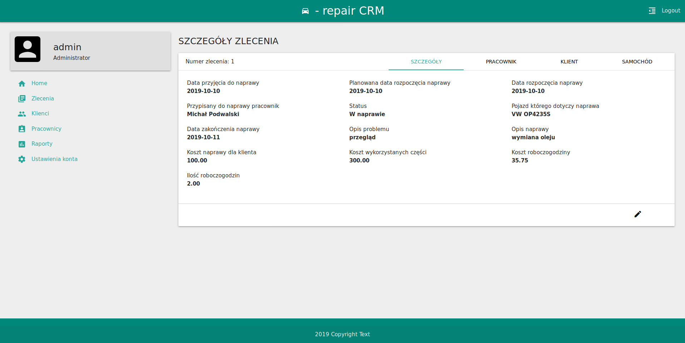

# Car-Repair CRM

System CRM do zarządzania działalnością warsztatu samochodowego.

## Funkcionalność
* Zarządzanie pracownikami
* Zarządzanie klientami
* Zarządzanie samochodami klientów
* Zarządzanie zleceniami napraw
* Tworzenie raportów:
	* raport wyrobionych godzin
	* uproszcząny raport zysków 
* Panel administracyjny

## Dostęp
- Korzystać z systemu może tylko zalogowany użytkownik. 
- Role zalogowanych użytkowników: ADMIN lub USER.
- W role usera można zarządzać klientami, samochodami, zleceniami oraz zmianą ustawień osobistego konta.
- W role admina można dodatkowo zarządzać pracownikami, tworzyć raporty oraz zarządzać wszystkymi zarejestrowanymi w systemie użytkownikami

| role  | login | hasło |
| ----- |:-----:| -----:|
| ADMIN | admin | admin |
| USER  | user  | user  |

## Start
Aplikacja została udostępniona pod adresem https://car-repair-crm.herokuapp.com/

## Technologję
* [Java Servlet & JSP](https://www.oracle.com/java/technologies/java-servlet-tec.html)
* [MaterializeCSS](https://materializecss.com/)
* [Chart.js](https://www.chartjs.org/)
* [MySQL](https://www.mysql.com/)
* [Maven](http://maven.apache.org/)
